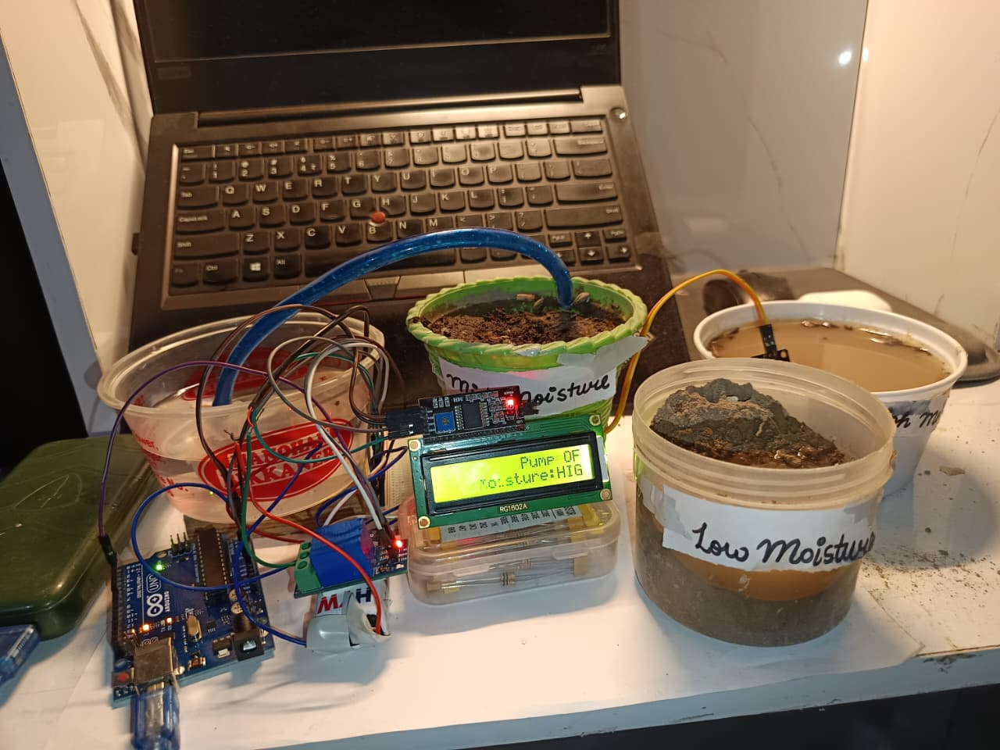

# 🪴 Smart Irrigation System using Arduino

An automated soil moisture monitoring and plant watering system designed to prevent over-watering and under-watering by tracking real-time moisture thresholds.

---

## 📸 Project Setup
Here is the complete physical hardware setup for testing different moisture levels:



---

## 📺 Project Video Demo
Aap hamare project ka working video yahan dekh sakte hain:

https://github.com/Sauhard-Git/Smart-Irrigation-System/blob/main/smartirrigationvideo.mp4

---

## 🚀 Key Features
- **Real-time Monitoring:** Continuously tracks soil moisture content using an analog sensor.
- **Three-Stage Logic:** Accurately differentiates between **Low**, **Mid**, and **High** moisture zones.
- **Automated Control:** Controls a 5V submersible water pump via a relay module based on soil conditions.
- **LCD Visual Status:** Displays current pump status (`Pump ON/OFF`) and moisture levels (`Moisture: HIGH/MID/LOW`) on a 16x2 LCD screen.

---

## 🛠️ Components Used
- **Microcontroller:** Arduino Uno
- **Display:** 16x2 LCD Display (with I2C Module)
- **Sensor:** Soil Moisture Sensor
- **Actuator:** 5V Relay Module & Mini Submersible Water Pump
- **Power Source:** 9V Battery / USB Power Cable
- **Testing Environment:** 3 Calibration Containers:
  1. **Low Moisture Container** (Dry Soil)
  2. **Mid Moisture Container** (Semi-dry/Ideal Soil)
  3. **High Moisture Container** (Fully Saturated Soil/Water)

---

## 🧠 System Logic & Working
The system reads analog values from the soil moisture sensor and processes them into three distinct zones:

| Moisture Level | Sensor Condition | Pump Status | LCD Display |
| :--- | :--- | :--- | :--- |
| **Low Moisture** | Soil is dry | **ON** (Watering) | `Pump: ON` <br> `Moisture: LOW` |
| **Mid Moisture** | Soil is partially wet | **OFF** (Stable) | `Pump: OFF` <br> `Moisture: MID` |
| **High Moisture** | Soil is fully saturated | **OFF** (Over-wet) | `Pump: OFF` <br> `Moisture: HIGH` |

---

## 📂 Project Structure
```text
Smart-Irrigation-System/
├── src/
│   └── smart_irrigation.ino   # Main Arduino Source Code
├── images/
│   └── image_f8546e.jpg       # Project Setup Image
└── README.md                  # Project Documentation
